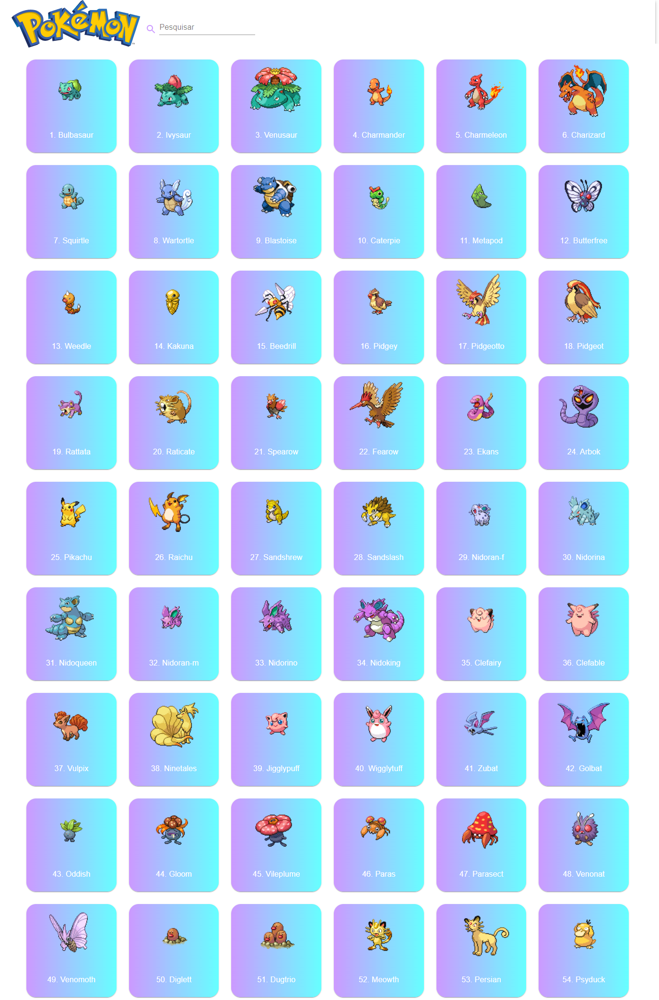
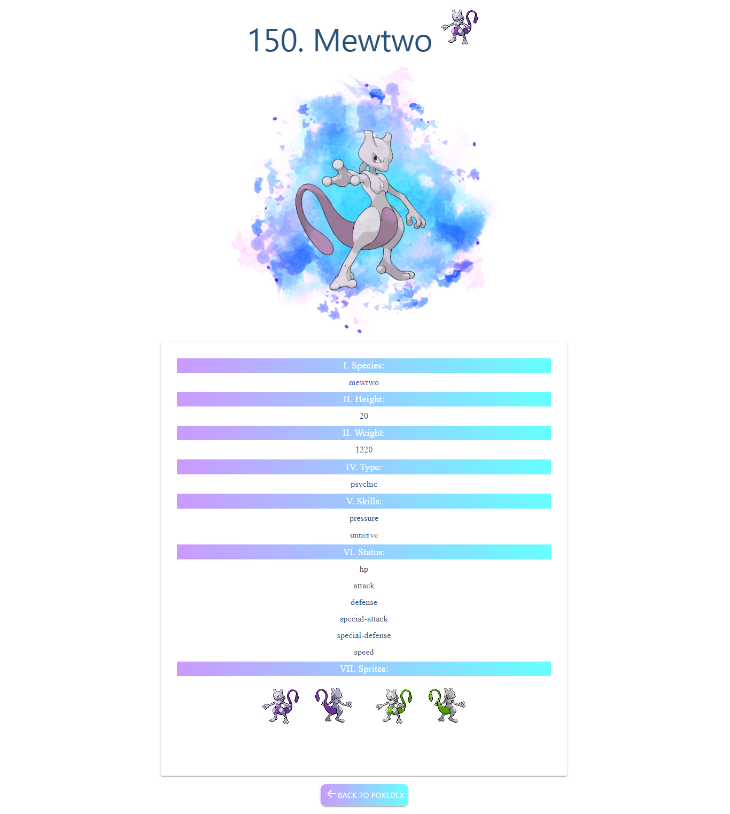

<h3 align="center">
     <br>
 
  
  ##   Pokedex 

  
 Pokedex criada utilizando React e consumindo API de [PokeApi](https://pokeapi.co/)


## :desktop_computer:	 Tecnologias Utilizadas
- [ReactJS](https://pt-br.reactjs.org/)
- [Material-UI](https://material-ui.com/pt/)
- [Axios](https://www.npmjs.com/package/axios)
- [React Router](https://reactrouter.com/)
- [PokeApi](https://pokeapi.co/)


## <dt> :gear: Instalações </dt>

```shell 

  $ yarn create react-app pokedex
  $ yarn add react-router-dom
  $ yarn add @material-ui/core
  $ npm i axios

```
## <dt> :boom: Imagens da aplicação </dt>

####  <dt> 1. Página inicial 1/2 </dt>

 

####  <dt> 2. Página de dados do pokemon 2/2 </dt>
 


